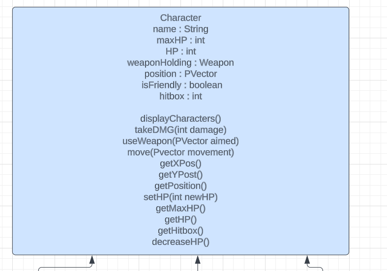
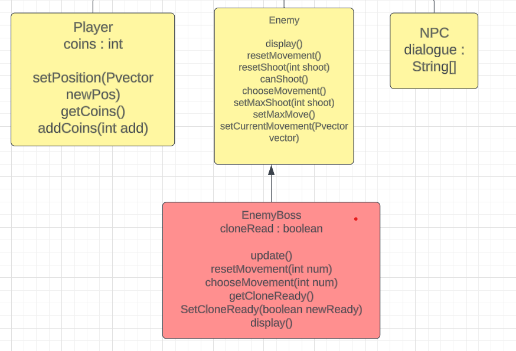

# APCS Final Project

## Group Info
Postassium Carbonate: Jason Xie and Casey Ye

## Overview
"Average RPG" will be a bullet hell game where the player follows a path through a dungeon. The dungeon consists of two regular enemy rooms, an HP restoration room, and a shop room, where players can buy upgraded weapons, in preparation for the final boss fight.

## Instructions
Please us W, A, S, D to move the player character. When you are ready to advance to the next stage, follow the green arrow and walk into the strip of green. There are different cheats included on the side to allow for an easier gameplay experience.

## Development Stages

1. Create classes
* Character clas
* ~~Weapon~~  Gun (includes shot() and reload()) ~~and Sword (includes swing())~~
* Bullet class (should spawn a moving sprite towards their target, with a stored damage variable and/or a time limit variable)
* Room class (LoadingRoom, Combat, Shop, Restore, ~~Encounter~~, Final Boss)

2. Functions for character classes
* Movement commands (Player moves off keyPressed system, enemies move based off player coordinates)
* Combat commands (use weapon command at specific target location, take damage, and deal damage)

3. Create room generation
* include enemies if combat rooms
* include singular NPC if ~~encounter room~~ shop or restore room

4. Create HP and coin counter

5. Create a "door mechanism" that will take the player to the next room

6. Implement NPC and dialogue

## UML

Character

